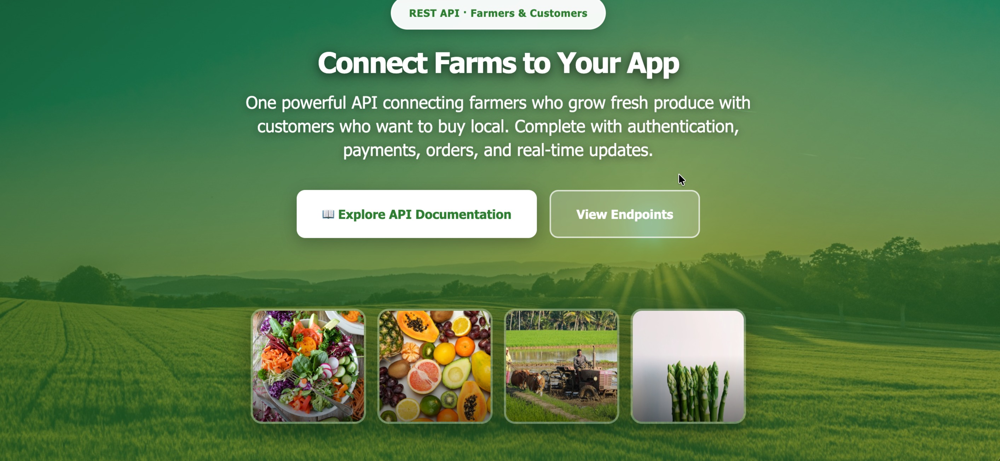

# Farm Marketplace API


[](https://nodejs.org/)
[](https://www.typescriptlang.org/)
[](https://www.postgresql.org/)
[](https://www.docker.com/)
[](https://github.com/features/actions)
[](https://vitest.dev/)




REST API backend for a farm marketplace that connects farmers (sellers) with customers (buyers). Built with TypeScript, Express, and PostgreSQL. Intended for consumption by web or mobile clients.

---

## Table of Contents

- [Overview](#overview)
- [Tech Stack](#tech-stack)
- [Features](#features)
- [Quick Start](#quick-start)
- [API](#api)
- [Testing](#testing)
- [Deployment](#deployment)
- [Project Structure](#project-structure)

---

## Overview

The Farm Marketplace API provides:

- **Authentication**: JWT with refresh tokens, role-based access (farmer, buyer, admin). *(OTP verification disabled — keeping auth simple.)*
- **Product catalog**: CRUD for farmers; search and filtering for customers.
- **Orders and payments**: Order lifecycle, payment collection via Adwa gateway.
- **Reviews**: Buyer reviews and ratings for sellers.
- **Notifications**: Push notifications (Expo) for order updates.
- **Security**: Rate limiting, Helmet headers, input validation (Zod), bcrypt password hashing.

The API is documented with OpenAPI 3.0 (Swagger) and runs behind a single Express server with a clear separation of routes, controllers, middleware, and models.

---

## Tech Stack

| Layer | Technologies |
|-------|--------------|
| Runtime | Node.js 20 |
| Language | TypeScript 5 |
| Framework | Express 4 |
| Database | PostgreSQL 15, Sequelize (with TypeScript) |
| Auth | JWT, bcrypt |
| Validation | Zod |
| File storage | Multer, Cloudinary |
| Notifications | Expo Push |
| Payments | Adwa |
| Testing | Vitest, Supertest |
| DevOps | Docker, GitHub Actions |

---

## Features

- **Authentication & security**: JWT + refresh tokens, RBAC, Zod validation, rate limiting, Helmet.
- **Products**: Full CRUD, search/filter, image upload (Cloudinary).
- **Orders**: Create, list, update; dispatch and status tracking.
- **Payments**: Payment collection and transaction records.
- **Reviews**: Create and list buyer reviews for farmers.
- **User profile**: Profile and avatar management.
- **Health**: `/api/v2/health` with database connectivity check.
- **Documentation**: Interactive Swagger UI at `/api-docs`.

---

## Quick Start

**Prerequisites:** Node.js 20+, Docker (optional), PostgreSQL.

```bash
git clone <repository-url>
cd farming-product-REST-api
yarn install
cp .env.example .env   # Configure database, JWT, and external services
```

**Local development:**

```bash
yarn db:migrate
yarn dev
```

**Run with Docker:**

```bash
docker build -t farming-api .
docker run -p 5002:5002 --env-file .env farming-api
# API: http://localhost:5002  |  Docs: http://localhost:5002/api-docs
```

Default port: **5002** (override with `PORT`). API base path: `/api/v2`.

---

## API

| Area | Examples |
|------|----------|
| Auth | `POST /api/v2/auth/signup`, `POST /api/v2/auth/login` *(OTP endpoints disabled)* |
| Users | `GET/PUT /api/v2/users/profile`, `POST /api/v2/users/upload-avatar` |
| Products | `GET/POST /api/v2/products`, `GET/PUT/DELETE /api/v2/products/:id` |
| Orders | `GET/POST /api/v2/orders` |
| Payments | `POST /api/v2/transactions` (payment collection) |
| Reviews | `GET/POST /api/v2/reviews` |
| Notifications | `GET/POST /api/v2/notifications` |
| System | `GET /api/v2/health`, `GET /api-docs` (Swagger) |

Protected routes use `Authorization: Bearer <token>`. Full request/response specs and security (JWT, rate limits, validation) are in the Swagger UI.

---

## Testing

```bash
yarn test          # Run test suite
yarn coverage      # Coverage report
yarn test:watch    # Watch mode
```

Tests use Vitest and Supertest; external services (email, payments) are mocked. Target: 80%+ coverage.

---

## Deployment

- **Docker:** Build and run with `docker build -t farming-api .` then `docker run -p 5002:5002 --env-file .env farming-api` (or pass env vars another way).
- **CI/CD:** GitHub Actions runs lint, format, build, tests, and coverage; builds and pushes a Docker image on push.

Key environment variables: `DATABASE_URL`, `JWT_SECRET`, `JWT_SECRET_REFRESH`, `CLOUDINARY_*`, `ADWA_MERCHANT_KEY`, and any Expo/Nodemailer config as needed.

---

## Project Structure

```
farming-product-REST-api/
├── src/
│   ├── controllers/     # auth, product, order, review, user, payment, notification
│   ├── middleware/      # auth-check, errorHandler, rateLimiter, multer
│   ├── models/          # Sequelize models (user, product, order, transaction, review, etc.)
│   ├── routes/          # auth, users, products, orders, reviews, transactions, notifications
│   ├── config/          # config.ts
│   ├── errors/          # customErrors
│   └── payment/         # payment provider interface and Adwa implementation
├── public/              # Static assets, welcome page, 404
├── tests/               # Vitest tests and mocks
├── migrations/          # Sequelize migrations
├── scripts/             # run-migrations, seed-db
├── app.ts               # Express app, Swagger, static serving
├── docker-compose.yml
└── Dockerfile
```

---

## License

ISC. See [LICENSE](LICENSE).

**Author:** [Avom Brice](https://maebrieporfolio.vercel.app)
